# IR追踪算法完整文档

## 1. 运行命令

```bash
conda run -n deepac python src_open/tools/live_tracking_realsense.py --cfg src_open/configs/live/realsense_ir_tracking.yaml
```

**参数说明：**
- `--cfg`: 配置文件路径（必需）

**交互操作：**
- 按 `s` 键：开始追踪（使用引导位姿初始化）
- 按 `q` 或 `ESC` 键：退出程序

---

## 2. 完整追踪算法流程图

```mermaid
graph TB
    Start([开始]) --> LoadConfig[加载配置文件]
    LoadConfig --> LoadModel[加载DeepAC模型]
    LoadModel --> LoadTemplates[加载预渲染模板]
    LoadTemplates --> InitCamera[初始化RealSense IR相机]
    InitCamera --> InitCLAHE[初始化CLAHE增强器]
    InitCLAHE --> InitState[初始化追踪状态]
    
    InitState --> MainLoop{主循环}
    
    MainLoop --> GetFrame[从RealSense获取IR图像]
    GetFrame --> CLAHEEnhance[CLAHE图像增强]
    CLAHEEnhance --> ConvertBGR[转换为BGR格式]
    ConvertBGR --> PreprocessFrame[预处理帧]
    
    PreprocessFrame --> CheckInit{是否已初始化?}
    
    CheckInit -->|否| ShowGuide[显示引导框]
    ShowGuide --> WaitKey{等待按键}
    WaitKey -->|按s键| InitTracking[初始化追踪]
    WaitKey -->|按q/ESC| End([结束])
    
    InitTracking --> InitHistogram[初始化直方图]
    InitHistogram --> SetInitialized[设置初始化标志]
    
    CheckInit -->|是| EdgeExtraction[边缘提取]
    
    EdgeExtraction --> ComputeGradient[计算梯度幅值]
    ComputeGradient --> ComputeEdgeStrength[计算边缘强度图]
    ComputeEdgeStrength --> ComputeEdgeConfidence[计算边缘置信度图]
    
    ComputeEdgeConfidence --> TrackingStep[追踪步骤]
    
    TrackingStep --> GetBBox[获取当前位姿的BBox]
    GetBBox --> PreprocessImage[预处理图像]
    PreprocessImage --> SelectTemplates[选择Top-K模板]
    SelectTemplates --> ModelForward[模型前向传播]
    ModelForward --> GetNewPose[获取新位姿]
    
    GetNewPose --> ComputeContour[计算轮廓点]
    ComputeContour --> EstimateConfidence[估计轮廓置信度]
    EstimateConfidence --> UpdateHistogram[更新直方图]
    UpdateHistogram --> ComputeBBox[计算最终BBox]
    
    ComputeBBox --> DrawOverlay[绘制结果]
    DrawOverlay --> SavePose[保存位姿]
    SavePose --> WriteVideo[写入视频]
    WriteVideo --> Display[显示窗口]
    
    Display --> CheckKey{检查按键}
    CheckKey -->|继续| MainLoop
    CheckKey -->|退出| End
    
    SetInitialized --> MainLoop
    
    style Start fill:#90EE90
    style End fill:#FFB6C1
    style TrackingStep fill:#87CEEB
    style ModelForward fill:#FFD700
    style EdgeExtraction fill:#DDA0DD
    style EstimateConfidence fill:#F0E68C
```



---

## 3. 模块详细说明

### 3.1 初始化模块

#### 3.1.1 加载配置文件 (`LoadConfig`)
- **输入**: 配置文件路径 (`--cfg`)
- **输出**: `cfg` (OmegaConf对象)
- **功能**: 加载YAML配置文件，包含模型路径、对象属性、相机参数、追踪参数等

#### 3.1.2 加载DeepAC模型 (`LoadModel`)
- **输入**: 
  - `cfg.model.load_cfg`: 训练配置路径
  - `cfg.model.load_model`: 模型权重路径
- **输出**: `model` (DeepAC模型对象，已加载权重)
- **功能**: 加载训练好的DeepAC模型权重

#### 3.1.3 加载预渲染模板 (`LoadTemplates`)
- **输入**: `cfg.object.pre_render_pkl`: 预渲染模板文件路径
- **输出**: 
  - `template_views`: 模板视图张量 `[N_views, N_points, 8]`
  - `orientations`: 方向张量 `[N_views, 3]` (轴角表示)
  - `num_sample`: 每个视图的采样点数
- **功能**: 从pickle文件加载预渲染的模板视图和对应方向

#### 3.1.4 初始化RealSense IR相机 (`InitCamera`)
- **输入**: 
  - `cfg.camera.ir_index`: IR相机索引 (1=左IR, 2=右IR)
  - `cfg.camera.emitter_enabled`: 是否启用结构光发射器
  - `cfg.camera.set_width/height/fps`: 相机分辨率/帧率
- **输出**: `realsense_camera` (M3TRealSenseIRCamera对象)
- **功能**: 初始化RealSense IR相机，获取实际内参并更新配置

#### 3.1.5 初始化CLAHE增强器 (`InitCLAHE`)
- **输入**: 
  - `cfg.tracking.use_clahe`: 是否启用CLAHE
  - `cfg.tracking.clahe_clip_limit`: CLAHE对比度限制
- **输出**: `clahe` (cv2.CLAHE对象或None)
- **功能**: 创建CLAHE对象用于图像对比度增强

#### 3.1.6 准备初始位姿 (`PrepareInitialPose`)
- **输入**: 
  - `cfg.tracking.initial_view_index`: 初始视图索引
  - `cfg.tracking.init_depth`: 初始深度
  - `cfg.tracking.initial_translation`: 初始平移
  - `cfg.tracking.initial_rotation_z`: Z轴旋转角度
- **输出**: 
  - `initial_view_idx`: 初始视图索引
  - `initial_pose`: 初始位姿 (Pose对象)
  - `initial_template`: 初始模板视图
- **功能**: 根据配置创建初始位姿和模板

---

### 3.2 图像预处理模块

#### 3.2.1 获取IR图像 (`GetFrame`)
- **输入**: `realsense_camera` (RealSense相机对象)
- **输出**: `ir_image` (numpy array, uint8, shape: [H, W])
- **功能**: 从RealSense相机获取一帧IR灰度图像

#### 3.2.2 CLAHE图像增强 (`CLAHEEnhance`)
- **输入**: 
  - `ir_image`: 原始IR图像
  - `clahe`: CLAHE对象
- **输出**: `ir_image` (增强后的图像)
- **功能**: 应用CLAHE对比度限制自适应直方图均衡化，增强图像对比度

#### 3.2.3 转换为BGR格式 (`ConvertBGR`)
- **输入**: `ir_image` (灰度图像)
- **输出**: `frame_bgr` (BGR格式图像, shape: [H, W, 3])
- **功能**: 将灰度图像转换为BGR格式用于显示和处理

#### 3.2.4 预处理帧 (`PreprocessFrame`)
- **输入**: 
  - `frame_bgr`: BGR图像
  - `cfg.camera`: 相机配置
  - `device`: 计算设备
- **输出**: 
  - `frame_rgb`: RGB格式图像 (numpy array)
  - `ori_camera_cpu`: 原始相机对象 (CPU)
- **功能**: 将BGR转换为RGB，构建相机内参对象

---

### 3.3 边缘提取模块

#### 3.3.1 计算梯度幅值 (`ComputeGradient`)
- **输入**: `ir_image` (IR灰度图像)
- **输出**: `gradient_magnitude` (梯度幅值图, float32, shape: [H, W])
- **实现**: 
  - 使用Sobel算子计算x和y方向梯度
  - 计算梯度幅值: `sqrt(grad_x^2 + grad_y^2)`
  - 归一化到[0, 1]
- **功能**: 计算图像的梯度幅值，用于边缘检测

#### 3.3.2 计算边缘强度图 (`ComputeEdgeStrength`)
- **输入**: 
  - `ir_image`: IR图像
  - `gradient_magnitude`: 梯度幅值图（可选）
- **输出**: `edge_strength_map` (边缘强度图, float32, shape: [H, W])
- **实现**:
  - 使用Canny边缘检测获得二值边缘图
  - 结合梯度幅值和Canny边缘: `edge_strength = gradient * canny_binary`
  - 应用形态学操作（膨胀+腐蚀）增强边缘连续性
  - 归一化到[0, 1]
- **功能**: 计算边缘强度图，值越大表示边缘越强

#### 3.3.3 计算边缘置信度图 (`ComputeEdgeConfidence`)
- **输入**: 
  - `ir_image`: IR图像
  - `edge_strength_map`: 边缘强度图
  - `ksize`: 局部算子尺寸（默认1）
  - `tau`: Sigmoid平滑参数（默认5.0）
  - `use_fast_mode`: 是否使用快速模式（默认True）
- **输出**: `edge_confidence_map` (边缘置信度图, float32, shape: [H, W])
- **实现**:
  - **快速模式**: 直接使用归一化的边缘强度作为置信度
  - **标准模式**: 
    - 计算Laplacian或Sobel算子获得局部方差
    - 使用Sigmoid函数抑制speckle噪声
    - 与边缘强度联合: `confidence = sigmoid(local_var) * edge_strength`
- **功能**: 估计边缘的可信度，抑制IR图像中的speckle噪声和假边缘

---

### 3.4 追踪步骤模块 (`TrackingStep`)

#### 3.4.1 获取当前位姿的BBox (`GetBBox`)
- **输入**: 
  - `current_pose`: 当前位姿
  - `template_views`: 模板视图
  - `orientations`: 方向
  - `ori_camera`: 原始相机
  - `bbox_trim_ratio`: BBox裁剪比例
- **输出**: `bbox2d` (BBox张量, shape: [4], 格式: [cx, cy, w, h])
- **实现**:
  - 找到最接近的模板视图索引
  - 投影模板轮廓点到图像平面
  - 计算轮廓点的BBox
- **功能**: 根据当前位姿估计目标在图像中的边界框

#### 3.4.2 预处理图像 (`PreprocessImage`)
- **输入**: 
  - `frame_rgb`: RGB图像
  - `bbox2d`: 边界框
  - `ori_camera_cpu`: 原始相机（CPU）
  - `data_conf`: 数据配置
  - `device`: 计算设备
- **输出**: 
  - `img_tensor`: 预处理后的图像张量 (torch.Tensor, shape: [C, H, W])
  - `camera`: 预处理后的相机对象
- **实现**:
  - 根据BBox裁剪图像
  - 调整图像大小（resize）
  - 零填充（pad）
  - 填充到32的倍数（用于网络）
  - 相应调整相机内参
- **功能**: 对图像进行裁剪、缩放、填充等预处理，准备输入网络

#### 3.4.3 选择Top-K模板 (`SelectTemplates`)
- **输入**: 
  - `current_pose`: 当前位姿
  - `orientations`: 所有方向
  - `template_top_k`: Top-K数量（默认30）
  - `template_skip`: 模板跳过步长
- **输出**: 
  - `closest_template_views`: 最接近的K个模板视图
  - `closest_orientations`: 对应的K个方向
- **实现**:
  - 计算当前位姿与所有模板方向的距离
  - 选择最接近的K个模板（考虑skip步长）
- **功能**: 选择与当前位姿最接近的K个模板视图，用于网络优化

#### 3.4.4 模型前向传播 (`ModelForward`)
- **输入**: 
  - `img_tensor`: 预处理图像
  - `camera`: 预处理相机
  - `body2view_pose`: 当前位姿
  - `closest_template_views`: Top-K模板
  - `closest_orientations`: Top-K方向
  - `fore_hist`: 前景直方图
  - `back_hist`: 背景直方图
- **输出**: 
  - `new_pose`: 优化后的新位姿 (Pose对象)
  - `pred`: 模型预测结果字典
- **实现**:
  - 构建输入数据字典
  - 调用 `model._forward(data, visualize=False, tracking=True)`
  - 提取优化后的位姿: `pred["opt_body2view_pose"][-1][0]`
- **功能**: DeepAC模型优化位姿，输出新的位姿估计

#### 3.4.5 计算轮廓点 (`ComputeContour`)
- **输入**: 
  - `closest_template_views`: 模板视图
  - `new_pose`: 新位姿
  - `camera`: 相机对象
- **输出**: 
  - `centers_in_image`: 轮廓点在图像中的坐标
  - `centers_valid`: 有效性掩码
  - `normals_in_image`: 法向量（图像坐标系）
  - `fg_dist`: 前景SDF距离
  - `bg_dist`: 背景SDF距离
- **实现**:
  - 调用 `calculate_basic_line_data()` 计算轮廓点
  - 投影3D模板点到2D图像平面
  - 计算SDF距离场
- **功能**: 计算新位姿对应的轮廓点在图像中的位置和几何信息

#### 3.4.6 估计轮廓置信度 (`EstimateConfidence`)
- **输入**: 
  - `edge_strength_map`: 边缘强度图
  - `centers_ori`: 原始图像坐标系中的轮廓点
  - `valid_ori`: 有效性掩码
  - `depth_map`: 深度图（可选，当前未使用）
  - `edge_confidence_map`: 边缘置信度图
  - `edge_weight`: 边缘权重（默认0.6）
  - `depth_weight`: 深度权重（默认0.4）
- **输出**: `contour_confidence` (轮廓点置信度, numpy array, shape: [N])
- **实现**:
  1. **基础置信度计算** (`estimate_contour_confidence`):
     - 在轮廓点位置提取边缘强度值（双线性插值）
     - 如果有深度图，提取深度一致性
     - 加权融合: `confidence = edge_strength * edge_weight + depth_consistency * depth_weight`
  
  2. **IR边缘可信度融合**:
     - 在轮廓点位置提取边缘置信度值
     - 与基础置信度相乘: `confidence *= edge_confidence`
  
  3. **Lambertian物理一致性**:
     - 计算轮廓点法向量与视线方向的夹角
     - 使用cos(θ)作为权重: `confidence *= cos(θ)`
     - 限制在[0.05, 1.0]范围内
- **功能**: 估计每个轮廓点的置信度，结合边缘强度、边缘可信度、深度信息和物理一致性

#### 3.4.7 更新直方图 (`UpdateHistogram`)
- **输入**: 
  - `img_tensor`: 预处理图像
  - `centers_in_image`: 轮廓点坐标
  - `centers_valid`: 有效性掩码
  - `normals_in_image`: 法向量
  - `fg_dist`: 前景SDF距离
  - `bg_dist`: 背景SDF距离
  - `fore_hist`: 当前前景直方图
  - `back_hist`: 当前背景直方图
  - `fore_learn_rate`: 前景学习率（默认0.015）
  - `back_learn_rate`: 背景学习率（默认0.015）
- **输出**: 
  - `fore_hist`: 更新后的前景直方图
  - `back_hist`: 更新后的背景直方图
- **实现**:
  - 调用 `model.histogram.calculate_histogram()` 计算新直方图
  - 指数移动平均更新: 
    - `fore_hist = (1 - α_f) * fore_hist + α_f * fore_hist_new`
    - `back_hist = (1 - α_b) * back_hist + α_b * back_hist_new`
- **功能**: 更新前景和背景的颜色直方图，用于后续帧的匹配

#### 3.4.8 计算最终BBox (`ComputeBBox`)
- **输入**: 
  - `new_pose`: 新位姿
  - `template_views`: 模板视图
  - `orientations`: 方向
  - `ori_camera`: 原始相机
  - `bbox_trim_ratio`: BBox裁剪比例
- **输出**: 
  - `bbox`: 最终BBox (torch.Tensor, shape: [4])
  - `centers_ori`: 原始图像坐标系中的轮廓点
  - `valid_ori`: 有效性掩码
- **实现**:
  - 找到最接近新位姿的模板视图
  - 投影模板点到原始图像坐标系
  - 计算有效轮廓点的BBox
- **功能**: 计算新位姿在原始图像中的最终边界框和轮廓点

---

### 3.5 初始化追踪模块 (`InitTracking`)

#### 3.5.1 初始化直方图 (`InitHistogram`)
- **输入**: 
  - `frame_rgb`: RGB图像
  - `ori_camera_cpu`: 原始相机（CPU）
  - `current_pose`: 初始位姿
  - `template_views`: 模板视图
  - `orientations`: 方向
  - `model`: DeepAC模型
  - `device`: 计算设备
  - `data_conf`: 数据配置
  - `bbox_trim_ratio`: BBox裁剪比例
- **输出**: 
  - `fore_hist`: 初始前景直方图
  - `back_hist`: 初始背景直方图
  - `last_bbox`: 初始BBox
  - `last_centers`: 初始轮廓点
  - `last_valid`: 初始有效性掩码
- **实现**:
  - 调用 `initialize_from_pose_with_preprocess()`:
    1. 获取BBox并预处理图像
    2. 选择Top-K模板
    3. 计算轮廓点和SDF距离
    4. 计算初始直方图（不使用EMA，直接计算）
- **功能**: 使用初始位姿计算前景和背景的初始颜色直方图

---

### 3.6 可视化与输出模块

#### 3.6.1 绘制结果 (`DrawOverlay`)
- **输入**: 
  - `frame_rgb`: RGB图像
  - `last_bbox`: BBox
  - `last_centers`: 轮廓点
  - `last_valid`: 有效性掩码
  - `color`: 绘制颜色 (BGR格式)
- **输出**: `overlay` (绘制后的图像)
- **实现**:
  - 调用 `draw_overlay()` 函数:
    - 绘制BBox矩形
    - 绘制轮廓线（使用有效点）
    - 添加文本信息（FPS、置信度、帧号等）
- **功能**: 在图像上绘制追踪结果（BBox和轮廓线）

#### 3.6.2 保存位姿 (`SavePose`)
- **输入**: 
  - `current_pose`: 当前位姿
  - `geometry_unit`: 几何单位（米转毫米）
  - `pose_file`: 文件对象
- **输出**: 无（写入文件）
- **实现**:
  - 提取旋转矩阵R和平移向量t
  - 转换为毫米单位
  - 格式化为12个数字: `[R11, R12, R13, R21, R22, R23, R31, R32, R33, t1, t2, t3]`
  - 写入文件并刷新
- **功能**: 将每帧的位姿保存到文件

#### 3.6.3 写入视频 (`WriteVideo`)
- **输入**: 
  - `overlay`: 绘制后的图像
  - `video_writer`: 视频写入器对象
  - `out_size`: 输出尺寸
- **输出**: 无（写入视频文件）
- **实现**:
  - 调整图像大小以匹配输出尺寸
  - 调用 `video_writer.write()` 写入帧
- **功能**: 将追踪结果写入视频文件

#### 3.6.4 显示窗口 (`Display`)
- **输入**: 
  - `overlay`: 绘制后的图像
  - `window_name`: 窗口名称
- **输出**: 无（显示窗口）
- **实现**:
  - 调用 `cv2.imshow()` 显示图像
  - 调用 `cv2.waitKey(1)` 处理按键事件
- **功能**: 实时显示追踪结果窗口

---

## 4. 关键数据结构

### 4.1 Pose对象
- **类型**: `src_open.utils.geometry.wrappers.Pose`
- **数据格式**: `torch.Tensor`, shape: `[..., 12]`
  - 前9个元素: 旋转矩阵R (flatten)
  - 后3个元素: 平移向量t
- **方法**:
  - `Pose.from_Rt(R, t)`: 从旋转矩阵和平移向量创建
  - `Pose.from_aa(aa, t)`: 从轴角和平移向量创建
  - `.R`: 获取旋转矩阵 (shape: `[..., 3, 3]`)
  - `.t`: 获取平移向量 (shape: `[..., 3]`)

### 4.2 Camera对象
- **类型**: `src_open.utils.geometry.wrappers.Camera`
- **数据格式**: `torch.Tensor`, shape: `[..., 4]`
  - `[..., 0]`: fx (焦距x)
  - `[..., 1]`: fy (焦距y)
  - `[..., 2]`: cx (主点x)
  - `[..., 3]`: cy (主点y)
- **方法**:
  - `.view2image(points_3d)`: 3D点投影到2D图像平面
  - `.scale(scales)`: 缩放相机内参

### 4.3 模板视图
- **格式**: `torch.Tensor`, shape: `[N_views, N_points, 8]`
  - `[..., :3]`: 3D点坐标（物体坐标系）
  - `[..., 3:6]`: 法向量（物体坐标系）
  - `[..., 6:8]`: 其他属性

---

## 5. 配置参数说明

### 5.1 图像预处理参数
- `crop_border`: 裁剪边界（像素）
- `resize`: 调整大小（像素）
- `pad`: 零填充（像素）
- `resize_by`: 调整方式（"max"或"min"）

### 5.2 图像增强参数
- `use_clahe`: 是否启用CLAHE
- `clahe_clip_limit`: CLAHE对比度限制（默认4.0）

### 5.3 边缘提取参数
- `edge_weight`: 边缘强度权重（默认0.6）
- `depth_weight`: 深度信息权重（默认0.4）
- `edge_confidence_tau`: 边缘置信度Sigmoid参数（默认5.0）
- `use_fast_edge_confidence`: 是否使用快速边缘置信度模式（默认True）

### 5.4 模板选择参数
- `template_top_k`: Top-K模板数量（默认30）
- `template_skip`: 模板跳过步长（默认1）

### 5.5 追踪参数
- `fore_learn_rate`: 前景直方图学习率（默认0.015）
- `back_learn_rate`: 背景直方图学习率（默认0.015）
- `bbox_trim_ratio`: BBox裁剪比例（默认0.05）

### 5.6 时间一致性滤波参数（当前未使用）
- `use_temporal_filter`: 是否启用时间一致性滤波（默认True）
- `temporal_filter_alpha`: 基础平滑系数（默认0.3）
- `temporal_filter_min_alpha`: 最小平滑系数（默认0.1）
- `temporal_filter_max_alpha`: 最大平滑系数（默认0.6）

---

## 6. 性能优化

### 6.1 已实现的优化
1. **快速边缘置信度模式**: 跳过Laplacian计算，节省约70%时间
2. **torch.inference_mode()**: 比torch.no_grad()更快
3. **性能分析器**: 可选的性能分析，帮助定位瓶颈

### 6.2 性能分析
- 启用性能分析: `enable_profiling: true`
- 分析结果保存到: `save_dir/performance_profile.txt`
- 主要耗时模块:
  - `tracking_step`: 追踪步骤（包含模型推理）
  - `edge_extraction`: 边缘提取
  - `edge_confidence`: 边缘置信度计算
  - `clahe_enhancement`: CLAHE增强

---

## 7. 输出文件

### 7.1 位姿文件
- **路径**: `save_dir/pose.txt`
- **格式**: 每行12个数字，空格分隔
  - `R11 R12 R13 R21 R22 R23 R31 R32 R33 t1 t2 t3`
  - 平移单位: 毫米（mm）

### 7.2 视频文件（可选）
- **路径**: `save_dir/live_ir_innovative_YYYYMMDD_HHMMSS.avi`
- **格式**: AVI (XVID编码)
- **尺寸**: 由 `output_size` 配置
- **帧率**: 由 `output_fps` 配置

### 7.3 性能分析文件（可选）
- **路径**: `save_dir/performance_profile.txt`
- **内容**: 各模块的平均耗时统计

---

## 8. 注意事项

1. **初始化**: 必须按 `s` 键手动初始化，确保目标物体与引导框对齐
2. **相机内参**: RealSense相机会自动获取实际内参并更新配置
3. **图像格式**: 内部使用RGB格式，显示使用BGR格式
4. **设备**: 默认使用CUDA（如果可用），否则使用CPU
5. **内存**: 模板视图和模型权重会占用GPU显存，注意显存大小


